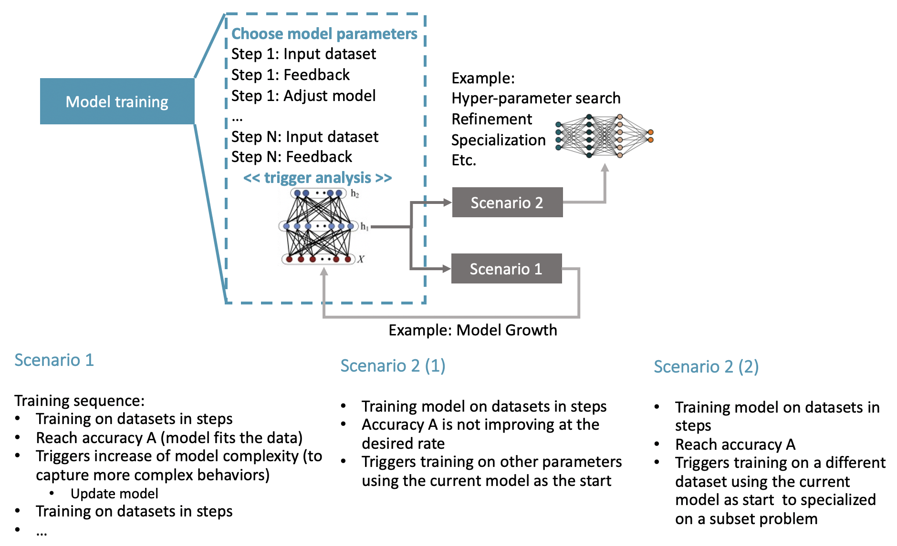
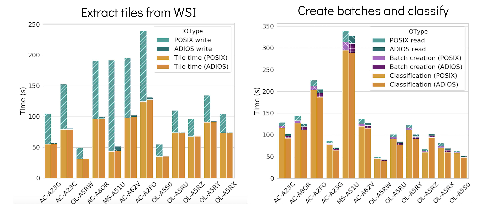

# Running ML applications

Codes in `/gpfs/alpine/csc143/proj-shared/againaru/medical`.

We are looking at pattern and performance analysis for AI applications. List of analyzed applications:
- **Quip classification** ([link](quip_classification/README.md)) uses 3 steps for preprocessing and the ML training/classification
- **CANDLE** ([link](candle.md))

Discussion on the model abstraction can be found [here](smc21-notes.md).

**Performance results switching to staging with ADIOS**

Quip classification

