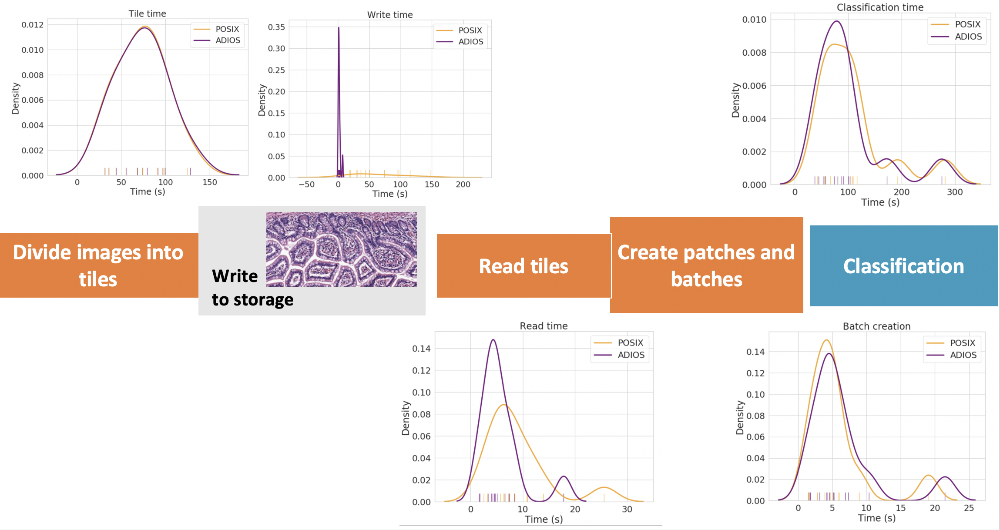

# Quip Classification

**Table of contents**
- [Quip Workflow](#workflow)
- [Running on Summit](#running-on-summit)
- [Performance on Summit](#performance-on-summit)
- Code available on [GitHub](https://github.com/SBU-BMI/quip_classification).

## Workflow


### Pre-processing

**Step 1. Divide image into tiles**

Tile extraction from a whole slide image is done in `quip_home/u24_lymphocyte/patch_extraction/save_svs_to_tiles.py` 

```python
pw = int(patch_size_20X * mag / 20);
width = oslide.dimensions[0];
height = oslide.dimensions[1];
for x in range(1, width, pw):
    for y in range(1, height, pw):
       patch = oslide.read_region((x, y), 0, (pw_x, pw_y));
       # filter, resize and write to png file
```

Non-overlapping tiles of fixed size are written one per png file. 

**Step 2 and 3. Divide tile into patches and create batches**

Patch extraction is implemented in `u24_lymphocyte/prediction/lymphocyte/pred.py` together with the batch creation in the `load_data` function.

```python
# parse all the tiles 
png = np.array(Image.open(full_fn).convert('RGB'));
for x in range(0, png.shape[1], APS):
    for y in range(0, png.shape[0], APS):
       # apply some transformation and add the patch in the batch 
       # until we reach the required BatchSize
       if xind >= BatchSize:
            break;
```

Tiles will not be split across batches. E.g. if the tile size is 10x10 and patch size is 1x1, there are 100 patches in one tile. If the BatchSize is 196, one batch will contain 200 patches (2 tiles).

### Classification

The main classification process is done in `u24_lymphocyte/prediction/lymphocyte/pred.py` in the `val_fn_epoch_on_disk` function.

```python
# all the tiles
todo_list = os.listdir(TileFolder);
while len(todo_list) > 0:
   # create current batch
   todo_list, inputs, inds, coor, rind = load_data(todo_list, rind);
   # create model parameters
   output = multi_win_during_val(val_fn, inputs, augs, targets);
```
The code concatenates the classification for each batch.

## Running on Summit

- [Code updates required to run](#modifications-to-the-code)
- [Building on Summit](#building-the-code)
- [Submitting the code on Summit](#submission)

Code can be found in `/gpfs/alpine/csc143/proj-shared/againaru/medical/quip_app` (Also in Dmitry's folder `/gpfs/alpine/world-shared/csc143/ganyushin/quip_app`)

The `data` contains the input and output data stored in 4 folders:
- `Output` contains the logs generated by the run
- `patches` contains short set of png images for debugging runs (tiles generated by the pre-processing)
- `patches.org` lager set of png images
- `svs` is a symbolic link for raw image data pointing to `/gpfs/alpine/csc303/world-shared/tkurc1/wsi/brca/`

### Modifications to the code

In the `quip_classification`, all the configuration files from the `u24_lymphocyte` need to point to the current path.
The following files need to be updated to point to the root path of the quip benchmark:
```
u24_lymphocyte/conf/variables.sh
u24_lymphocyte/prediction/NNFramework_TF_models/config_incep-mix_test_ext.ini
u24_lymphocyte/prediction/NNFramework_TF_models/config_incep-mix_test_ext.ini.new
u24_lymphocyte/prediction/NNFramework_TF_models/config_incep-mix_test_ext_binary.ini
u24_lymphocyte/prediction/NNFramework_TF_models/config_incep-mix_test_ext_binary.ini.new
u24_lymphocyte/prediction/NNFramework_TF_models/config_vgg-mix_test_ext.ini
u24_lymphocyte/prediction/NNFramework_TF_models/config_vgg-mix_test_ext.ini.new
u24_lymphocyte/prediction/NNFramework_TF_models/config_vgg-mix_test_ext_binary.ini
u24_lymphocyte/prediction/NNFramework_TF_models/config_vgg-mix_test_ext_binary.ini.new
```

Example line that needs update (in `u24_lymphocyte/conf/variables.sh`):
```
export APP_DIR=/gpfs/alpine/csc143/proj-shared/againaru/medical/quip_app
```

### Building the code

The `mpi4py` package is not installed by default in the ML environment. For this purpose, a local clone needs to be created and the package installed.

```bash
module load  ibm-wml-ce/1.6.2-1
conda create --name cloned-ibm-env --clone ibm-wml-ce-1.6.2-1
conda activate cloned-ibm-env
conda install mpi4py
conda install numpy
conda install pillow
```

By default this should create the cloned environment in `/ccs/home/againaru/.conda/envs/cloned-ibm-env`. This has to be done only once. Future uses will use:

```bash
module load  ibm-wml-ce/1.6.2-1
conda activate cloned-ibm-env
```

From the cloned environment ADIOS2 can be built with python bindings. ADIOS2 python and OpenSlide have been built by Dmitry and can be linked directly.

```
module load  ibm-wml-ce/1.6.2-1
conda activate ibm-wml-ce-1.6.2-1 
module load hdf5

#ADIOS2
export PYTHONPATH=/gpfs/alpine/world-shared/csc143/ganyushin/quip_app/ADIOS2-Python-fast/build/lib/python3.6/site-packages:$PYTHONPATH
export LD_LIBRARY_PATH=/gpfs/alpine/world-shared/csc143/ganyushin/quip_app/ADIOS2-Python-fast/build/lib64:$LD_LIBRARY_PATH

#Openslide-python
export PYTHONPATH=/gpfs/alpine/world-shared/csc143/ganyushin/quip_app/openslide-python-1.1.2/build/lib.linux-ppc64le-3.6:$PYTHONPATH
#openslide - so
export LD_LIBRARY_PATH=/gpfs/alpine/world-shared/csc143/ganyushin/quip_app/openslide-rpm/usr/lib64/:$LD_LIBRARY_PATH
#openjpeg
export LD_LIBRARY_PATH=/gpfs/alpine/world-shared/csc143/ganyushin/quip_app/libopenjpeg1-rpm/usr/lib64:$LD_LIBRARY_PATH
```

### Submission

Benchmark consist of 3 steps:
- Preprocessing: making png files from raw images in data/patches
- Classification
- Postprocessing

Make symbolic links in your_root_directory /quip_app/data/
```bash
cd your_root_directory/quip_app/data
ln -s svs_12 svs
ln -s patches_12 patches
```

**Preprocessing**

```
cd quip_app/patch_extraction/
bsub dl_preproc.sh
```

Files for each tile will be created in the `data/patches` folder. A file `.txt` is created when the process is finished.

**Classification**

```
cd quip_app/quip_classification/
bsub dl_benchmark.sh
```

Logs will be created in `data/output`. A `patch-level-lym.txt` file will be created in `data/patches/*.svs/` folders.
 

## Performance on Summit

Detailed information in the [dedicated README page](./performance/README.md)


