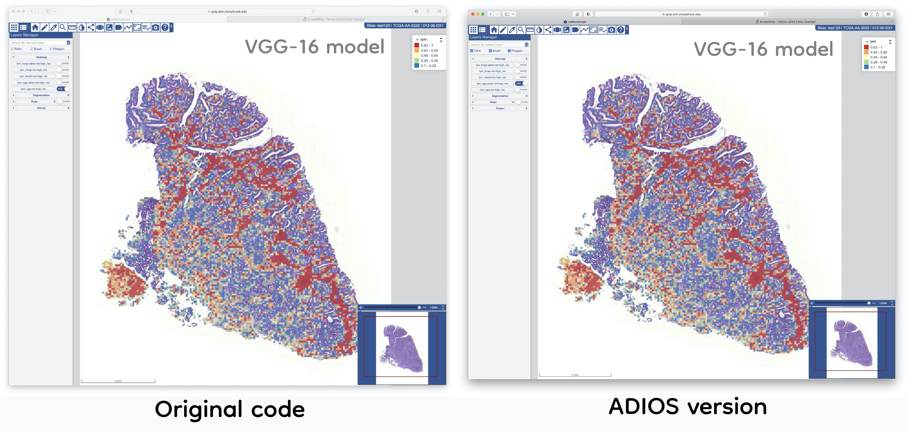
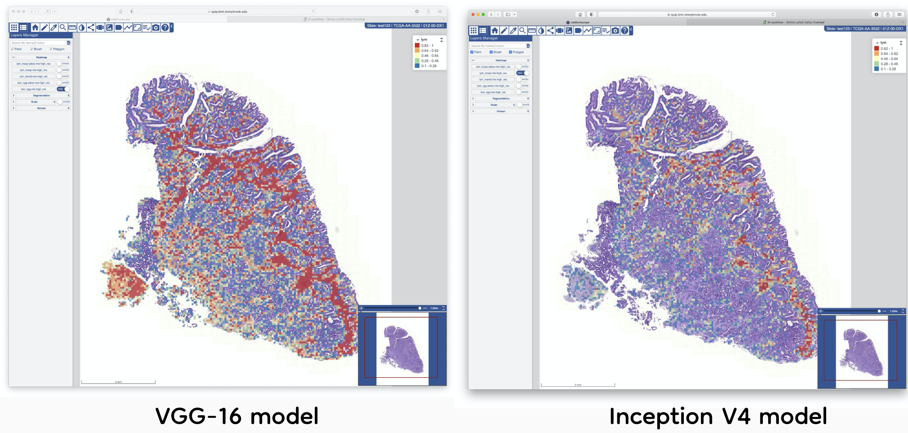
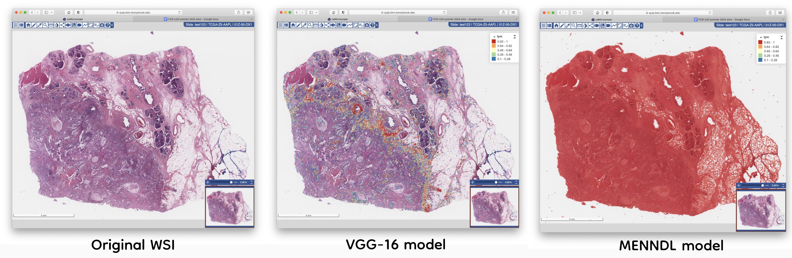
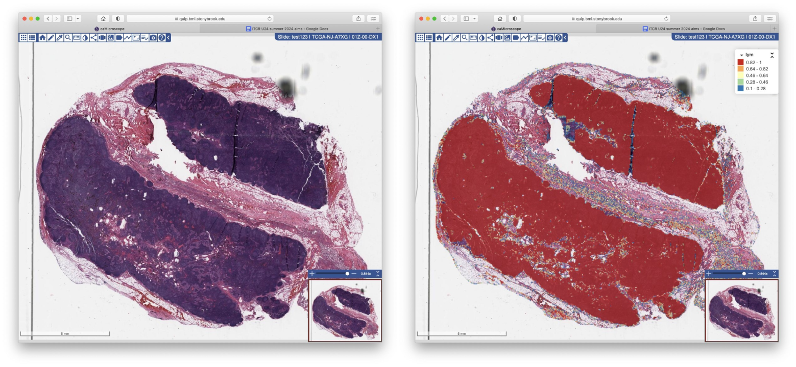

## Correctness tests for the QUIP classification 

- Between MENNDL / VGG and Inception models
- Between ADIOS and the original code

**Using the corretness script**

Using the `test_correctness.py` script requires the `patch-level-lym.txt` files generated by the prediction script within QUIP for a given model. 
If no threshold is specified the script will compare all the entries in the patch file. If only one threshold is given, both thresholds are set to the given value.

```
$ python test_correctness.py
Usage: python test_correctness.py file_model1 file_model2 [threshold1 threshold2]
```

### Correctness between the original code and the ADIOS model

The path files obtained with VGG-16, Inception V4 and MENNDL using the ADIOS version were compared with the ones from the original code and obtained a dice score of 1 (perfect match). The prediction values are not the same but the identified patches using the same thresholds are exactly the same.

```
$ python test_correctness.py patch-level-lym-vgg.txt patch-level-lym-vgg.txt
Dice coeficient: 1.0
DONE
```
Visual inspection of the heatmap files generated with the two versions of the code show the same conclusion as the correctness script.  

Example heatmap for the VGG-16 model using the original code and the ADIOS version.


### Correctness between Inception and the VGG model

- Model for VGG: `./u24_lymphocyte/prediction/NNFramework_TF_models/config_vgg-mix_test_ext.ini`
- Model for Inception: `./u24_lymphocyte/prediction/NNFramework_TF_models/config_incep-mix_test_ext.ini`

```
python test_correctness.py ../../../quip_adios/data/patches/TCGA-56-7823-01Z-00-DX1.354861d2-79f1-4b70-a74e-20cb0f78468e.svs/patch-level-lym-VGG.txt ../../../quip_adios/data/patches/TCGA-56-7823-01Z-00-DX1.354861d2-79f1-4b70-a74e-20cb0f78468e.svs/patch-level-lym-Inception.txt 0.42 0.1
Dice coeficient: 1.1744847890088321
First model has 2307 unique patched detected out of 8616 total detections
	- extra patches have a median prediction values of 0.5336229205131531
Second model has 360 unique patched detected out of 6669 total detections
	- model extra patches have a median prediction values of 0.13172979652881622
DONE
```



### Correctness between MENNDL and the VGG model

Examples of generating the prediction codes

```
python -u ./u24_lymphocyte/prediction/lymphocyte/pred_by_external_model.py WSI.svs {path_to_model} patch-level-lym.txt 96 0
```

- Model for VGG: `./u24_lymphocyte/prediction/NNFramework_TF_models/config_vgg-mix_test_ext.ini`
- Model for MENNDL: `./u24_lymphocyte/prediction/Pytorch_MENNDL_model/a79773ce-5aed-11e9-9b65-70e2841459e0`



