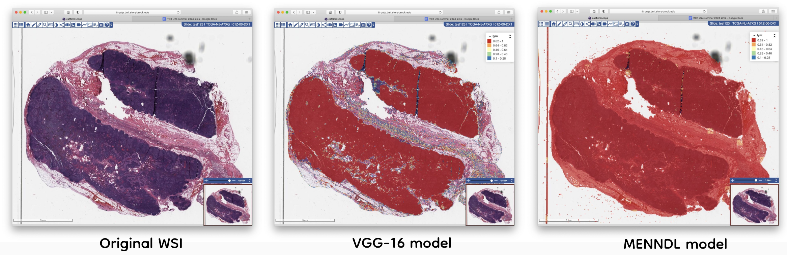

## Correctness tests for the QUIP classification 

- Between MENNDL / VGG and Inception models
- Between ADIOS and the original code

**Using the corretness script**

Using the `test_correctness.py` script requires the `patch-level-lym.txt` files generated by the prediction script within QUIP for a given model. 
If no threshold is specified the script will compare all the entries in the patch file. If only one threshold is given, both thresholds are set to the given value.

```
$ python test_correctness.py
Usage: python test_correctness.py file_model1 file_model2 [threshold1 threshold2]
```

### Correctness between MENNDL and the VGG model

Examples of generating the prediction codes

```
python -u ./u24_lymphocyte/prediction/lymphocyte/pred_by_external_model.py WSI.svs {path_to_model} patch-level-lym.txt 96 0
```

- Model for VGG: `./u24_lymphocyte/prediction/NNFramework_TF_models/config_vgg-mix_test_ext.ini`
- Model for MENNDL: `./u24_lymphocyte/prediction/Pytorch_MENNDL_model/a79773ce-5aed-11e9-9b65-70e2841459e0`



